# 🗄️ Database Architecture — Ethiopian Business Management System
**v2.0.0 · PostgreSQL · Multi-tenant (RLS) · Generated 2026-04-21**

---

## 📋 Quick Navigation

| # | Module | Tables | RLS |
|---|---|---|---|
| 1 | [🔐 Auth & Security](#1--auth--security) | `users` · `login_history` · `api_tokens` · `refresh_tokens` · `password_reset_tokens` | — |
| 2 | [🏢 Tenant / Multi-company](#2--tenant--multi-company) | `tenants` · `licenses` · `license_audit` | — |
| 3 | [🧾 VAT](#3--vat) | `vat_income` · `vat_expenses` · `vat_capital` | ✅ |
| 4 | [💰 Income & Expense](#4--income--expense) | `income_records` · `expense_records` | ✅ |
| 5 | [📒 Journal Entries](#5--journal-entries) | `journal_entries` · `journal_entry_lines` | ✅ |
| 6 | [📊 Chart of Accounts](#6--chart-of-accounts) | `chart_of_accounts` | ✅ |
| 7 | [🔄 Transactions](#7--transactions) | `transactions` · `flagged_accounts` · `transaction_import_history` | ✅ |
| 8 | [👥 Employees & Payroll](#8--employees--payroll) | `employees` · `payroll_data` · `allowance_definitions` · `deduction_definitions` · `employee_allowances` · `employee_deductions` | ✅ |
| 9 | [🏛️ HRM](#9--hrm) | `hrm_payroll_runs` · `hrm_leave_requests` · `hrm_training_records` · `hrm_performance_reviews` · `hrm_grievances` | — |
| 10 | [📈 Finance Management](#10--finance-management) | `fin_gl_entries` · `fin_ar_ap` · `fin_assets` · `fin_budgets` · `fin_shareholders` · `fin_dividends` | — |
| 11 | [📦 Inventory](#11--inventory) | 7 tables | ✅ |
| 12 | [📝 Bid Tracker](#12--bid-tracker) | `bid_records` · `bid_documents_meta` | ✅ |
| 13 | [📋 CPO](#13--cpo) | `cpo_records` · `cpo_import_history` | ✅ |
| 14 | [⚙️ Machinery](#14--machinery) | 7 tables | — |
| 15 | [🎓 LMS](#15--lms) | `lms_courses` · `lms_learning_paths` · `lms_enrollments` · `lms_certificates` | — |
| 16 | [🛡️ SIEM](#16--siem) | `siem_events` · `siem_alerts` | — |
| 17 | [🗂️ System](#17--system) | `backup_log` · `version_registry` · `sales_contacts` | — |

**Total: 47 tables · 15 RLS-protected · 3 hard FK constraints**

---

## Architecture Overview

```
┌─────────────────────────────────────────────────────────────────────┐
│                        BROWSER / API CLIENT                         │
└────────────────────────────┬────────────────────────────────────────┘
                             │  HTTP
┌────────────────────────────▼────────────────────────────────────────┐
│                    FastAPI Route Handlers                            │
│  • Reads company_id from  request.session["current_company_id"]     │
│  • Injects company_id into every record dict before write           │
│  • Calls _invalidate_cache(company_id) after every write            │
└────────────────────────────┬────────────────────────────────────────┘
                             │
              ┌──────────────┴──────────────┐
              │                             │
┌─────────────▼──────────┐    ┌─────────────▼──────────────┐
│   get_tenant_cursor()   │    │      get_conn()             │
│                         │    │                             │
│  SET LOCAL              │    │  Application-level          │
│  app.current_company_id │    │  WHERE company_id = ?       │
│  → PostgreSQL RLS       │    │  (fallback when no RLS)     │
└─────────────┬───────────┘    └─────────────┬──────────────┘
              │                              │
              └──────────────┬───────────────┘
                             │
┌────────────────────────────▼────────────────────────────────────────┐
│                    PostgreSQL (AWS RDS)                              │
│                                                                     │
│   ┌──────────┐  ┌──────────┐  ┌──────────┐  ┌──────────────────┐  │
│   │  users   │  │ tenants  │  │employees │  │  fin_gl_entries  │  │
│   └──────────┘  └──────────┘  └──────────┘  └──────────────────┘  │
│       ...            ...           ...              ...             │
│                                                                     │
│   Row-Level Security (RLS): 15 tables enforce                       │
│   company_id isolation at the PostgreSQL engine level               │
└─────────────────────────────────────────────────────────────────────┘
```

---

## Primary Key Convention

| Pattern | Example tables | Notes |
|---|---|---|
| `TEXT` UUID (app-generated) | `users`, `vat_income`, `bid_records` | `str(uuid.uuid4())` in Python |
| `VARCHAR(64)` (app-generated) | `machinery_assets`, `lms_courses`, `hrm_*` | Same UUID, shorter type |
| **Composite PK** | `chart_of_accounts`, `payroll_data`, `employee_allowances` | Two or more columns together form the PK |
| `UUID` (DB-generated) | `sales_contacts` | `DEFAULT gen_random_uuid()` |
| `TEXT` (domain key) | `allowance_definitions`, `deduction_definitions` | Human-readable name IS the PK |

---

## 1 · 🔐 Auth & Security

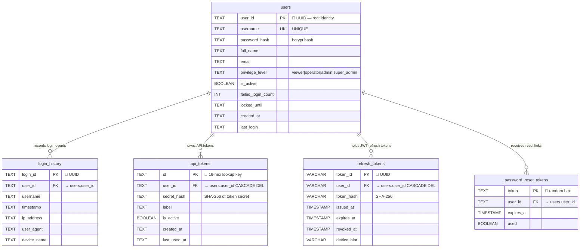
```mermaid
erDiagram
    users {
        TEXT user_id       PK "🔑 UUID — root identity"
        TEXT username      UK "UNIQUE"
        TEXT password_hash    "bcrypt hash"
        TEXT full_name
        TEXT email
        TEXT privilege_level  "viewer|operator|admin|super_admin"
        BOOLEAN is_active
        INT  failed_login_count
        TEXT locked_until
        TEXT created_at
        TEXT last_login
    }

    login_history {
        TEXT    login_id   PK "🔑 UUID"
        TEXT    user_id    FK "→ users.user_id"
        TEXT    username
        TEXT    timestamp
        TEXT    ip_address
        TEXT    user_agent
        TEXT    device_name
    }

    api_tokens {
        TEXT    id         PK "🔑 16-hex lookup key"
        TEXT    user_id    FK "→ users.user_id CASCADE DEL"
        TEXT    secret_hash   "SHA-256 of token secret"
        TEXT    label
        BOOLEAN is_active
        TEXT    created_at
        TEXT    last_used_at
    }

    refresh_tokens {
        VARCHAR token_id   PK "🔑 UUID"
        VARCHAR user_id    FK "→ users.user_id CASCADE DEL"
        VARCHAR token_hash    "SHA-256"
        TIMESTAMP issued_at
        TIMESTAMP expires_at
        TIMESTAMP revoked_at
        VARCHAR device_hint
    }

    password_reset_tokens {
        TEXT    token      PK "🔑 random hex"
        TEXT    user_id    FK "→ users.user_id"
        TIMESTAMP expires_at
        BOOLEAN used
    }

    users ||--o{ login_history         : "records login events"
    users ||--o{ api_tokens            : "owns API tokens"
    users ||--o{ refresh_tokens        : "holds JWT refresh tokens"
    users ||--o{ password_reset_tokens : "receives reset links"
```

> **Hard FK constraints:** `api_tokens.user_id` and `refresh_tokens.user_id` have `ON DELETE CASCADE` declared in DDL. `login_history` and `password_reset_tokens` are app-enforced only.

---

## 2 · 🏢 Tenant / Multi-company

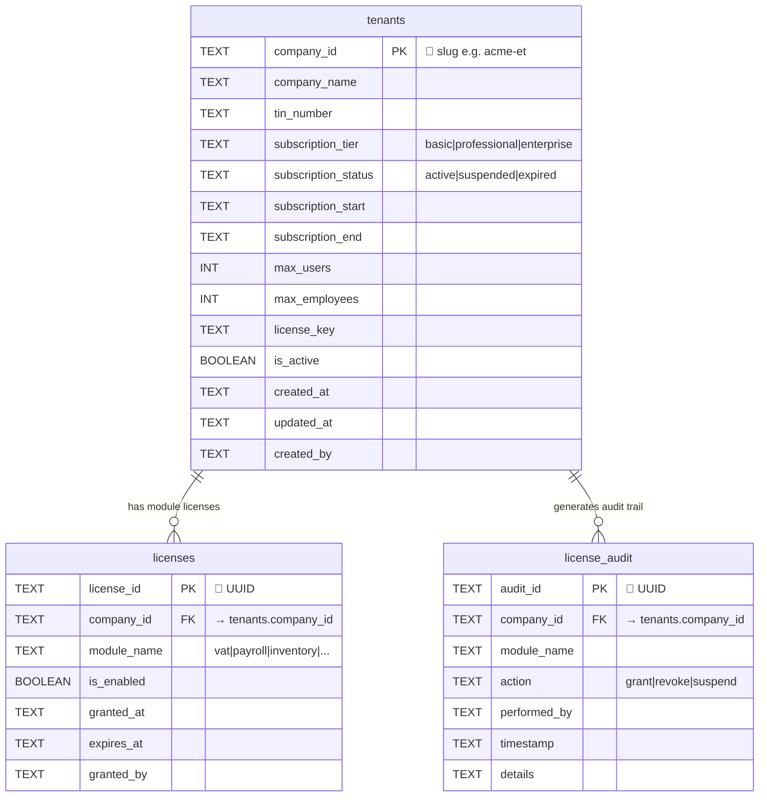
```mermaid
erDiagram
    tenants {
        TEXT company_id         PK "🔑 slug e.g. acme-et"
        TEXT company_name
        TEXT tin_number
        TEXT subscription_tier     "basic|professional|enterprise"
        TEXT subscription_status   "active|suspended|expired"
        TEXT subscription_start
        TEXT subscription_end
        INT  max_users
        INT  max_employees
        TEXT license_key
        BOOLEAN is_active
        TEXT created_at
        TEXT updated_at
        TEXT created_by
    }

    licenses {
        TEXT    license_id  PK "🔑 UUID"
        TEXT    company_id  FK "→ tenants.company_id"
        TEXT    module_name    "vat|payroll|inventory|..."
        BOOLEAN is_enabled
        TEXT    granted_at
        TEXT    expires_at
        TEXT    granted_by
    }

    license_audit {
        TEXT audit_id    PK "🔑 UUID"
        TEXT company_id  FK "→ tenants.company_id"
        TEXT module_name
        TEXT action         "grant|revoke|suspend"
        TEXT performed_by
        TEXT timestamp
        TEXT details
    }

    tenants ||--o{ licenses      : "has module licenses"
    tenants ||--o{ license_audit : "generates audit trail"
```

> **`tenants.company_id`** is the root tenant key referenced logically by every multi-tenant table in the system (via app-level `WHERE company_id = ?` or PostgreSQL RLS).

---

## 3 · 🧾 VAT

> ✅ All three tables have RLS policies — `SET LOCAL app.current_company_id` required.

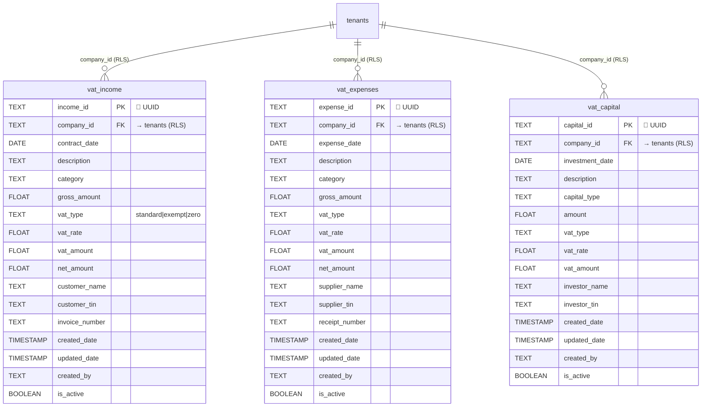
```mermaid
erDiagram
    vat_income {
        TEXT      income_id      PK "🔑 UUID"
        TEXT      company_id     FK "→ tenants (RLS)"
        DATE      contract_date
        TEXT      description
        TEXT      category
        FLOAT     gross_amount
        TEXT      vat_type          "standard|exempt|zero"
        FLOAT     vat_rate
        FLOAT     vat_amount
        FLOAT     net_amount
        TEXT      customer_name
        TEXT      customer_tin
        TEXT      invoice_number
        TIMESTAMP created_date
        TIMESTAMP updated_date
        TEXT      created_by
        BOOLEAN   is_active
    }

    vat_expenses {
        TEXT      expense_id     PK "🔑 UUID"
        TEXT      company_id     FK "→ tenants (RLS)"
        DATE      expense_date
        TEXT      description
        TEXT      category
        FLOAT     gross_amount
        TEXT      vat_type
        FLOAT     vat_rate
        FLOAT     vat_amount
        FLOAT     net_amount
        TEXT      supplier_name
        TEXT      supplier_tin
        TEXT      receipt_number
        TIMESTAMP created_date
        TIMESTAMP updated_date
        TEXT      created_by
        BOOLEAN   is_active
    }

    vat_capital {
        TEXT      capital_id     PK "🔑 UUID"
        TEXT      company_id     FK "→ tenants (RLS)"
        DATE      investment_date
        TEXT      description
        TEXT      capital_type
        FLOAT     amount
        TEXT      vat_type
        FLOAT     vat_rate
        FLOAT     vat_amount
        TEXT      investor_name
        TEXT      investor_tin
        TIMESTAMP created_date
        TIMESTAMP updated_date
        TEXT      created_by
        BOOLEAN   is_active
    }

    tenants ||--o{ vat_income    : "company_id (RLS)"
    tenants ||--o{ vat_expenses  : "company_id (RLS)"
    tenants ||--o{ vat_capital   : "company_id (RLS)"
```

---

## 4 · 💰 Income & Expense

> ✅ Both tables have RLS policies.

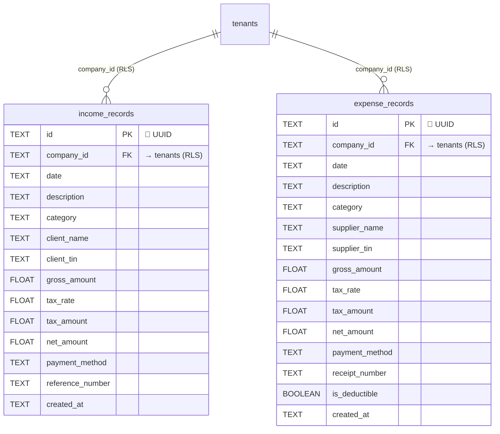
```mermaid
erDiagram
    income_records {
        TEXT  id               PK "🔑 UUID"
        TEXT  company_id       FK "→ tenants (RLS)"
        TEXT  date
        TEXT  description
        TEXT  category
        TEXT  client_name
        TEXT  client_tin
        FLOAT gross_amount
        FLOAT tax_rate
        FLOAT tax_amount
        FLOAT net_amount
        TEXT  payment_method
        TEXT  reference_number
        TEXT  created_at
    }

    expense_records {
        TEXT    id             PK "🔑 UUID"
        TEXT    company_id     FK "→ tenants (RLS)"
        TEXT    date
        TEXT    description
        TEXT    category
        TEXT    supplier_name
        TEXT    supplier_tin
        FLOAT   gross_amount
        FLOAT   tax_rate
        FLOAT   tax_amount
        FLOAT   net_amount
        TEXT    payment_method
        TEXT    receipt_number
        BOOLEAN is_deductible
        TEXT    created_at
    }

    tenants ||--o{ income_records  : "company_id (RLS)"
    tenants ||--o{ expense_records : "company_id (RLS)"
```

---

## 5 · 📒 Journal Entries

> ✅ `journal_entries` has RLS. `journal_entry_lines` is protected via parent JOIN.

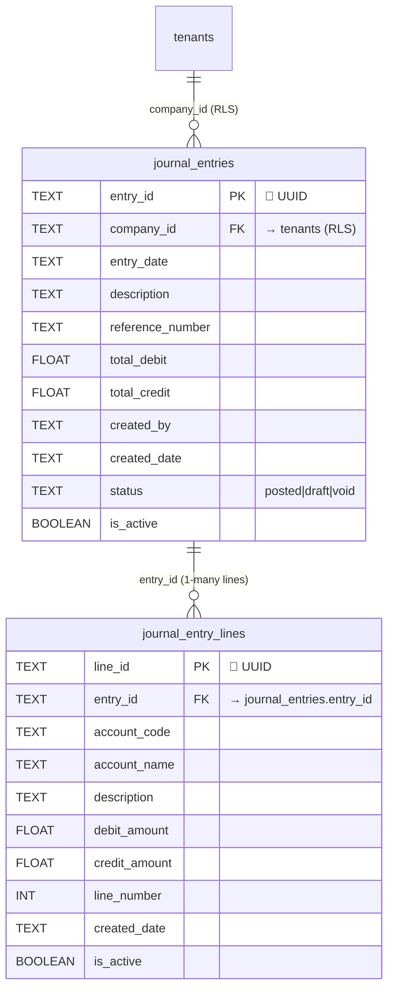
```mermaid
erDiagram
    journal_entries {
        TEXT   entry_id        PK "🔑 UUID"
        TEXT   company_id      FK "→ tenants (RLS)"
        TEXT   entry_date
        TEXT   description
        TEXT   reference_number
        FLOAT  total_debit
        FLOAT  total_credit
        TEXT   created_by
        TEXT   created_date
        TEXT   status             "posted|draft|void"
        BOOLEAN is_active
    }

    journal_entry_lines {
        TEXT   line_id         PK "🔑 UUID"
        TEXT   entry_id        FK "→ journal_entries.entry_id"
        TEXT   account_code
        TEXT   account_name
        TEXT   description
        FLOAT  debit_amount
        FLOAT  credit_amount
        INT    line_number
        TEXT   created_date
        BOOLEAN is_active
    }

    tenants         ||--o{ journal_entries     : "company_id (RLS)"
    journal_entries ||--o{ journal_entry_lines : "entry_id (1-many lines)"
```

> `total_debit` must equal `total_credit` — enforced at the application layer, not DB constraint.

---

## 6 · 📊 Chart of Accounts

> ✅ RLS enabled. Composite primary key: `(account_code, company_id)`.

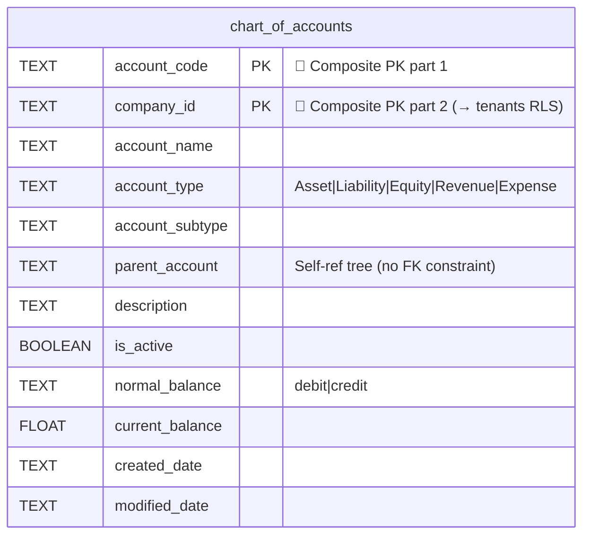
```mermaid
erDiagram
    chart_of_accounts {
        TEXT    account_code   PK "🔑 Composite PK part 1"
        TEXT    company_id     PK "🔑 Composite PK part 2 (→ tenants RLS)"
        TEXT    account_name
        TEXT    account_type      "Asset|Liability|Equity|Revenue|Expense"
        TEXT    account_subtype
        TEXT    parent_account    "Self-ref tree (no FK constraint)"
        TEXT    description
        BOOLEAN is_active
        TEXT    normal_balance    "debit|credit"
        FLOAT   current_balance
        TEXT    created_date
        TEXT    modified_date
    }
```

> **Composite PK** means account code `1000` can exist independently for each tenant. `parent_account` references `account_code` within the same company (tree structure) — enforced by app logic only.

---

## 7 · 🔄 Transactions

> ✅ `transactions` and `flagged_accounts` have RLS.

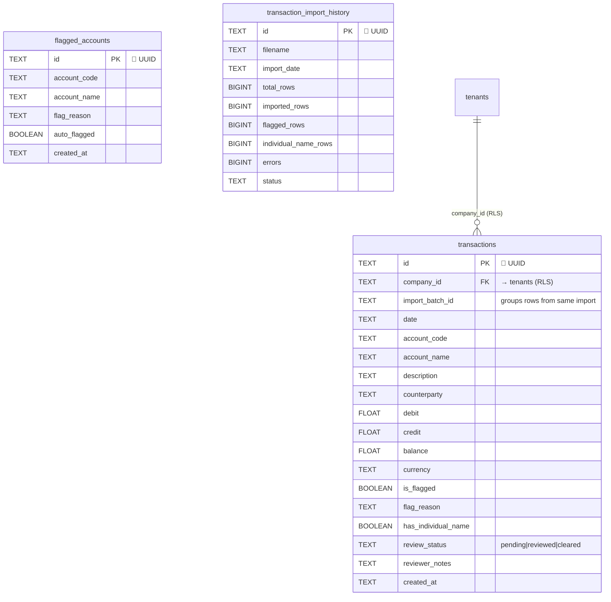
```mermaid
erDiagram
    transactions {
        TEXT    id                   PK "🔑 UUID"
        TEXT    company_id           FK "→ tenants (RLS)"
        TEXT    import_batch_id         "groups rows from same import"
        TEXT    date
        TEXT    account_code
        TEXT    account_name
        TEXT    description
        TEXT    counterparty
        FLOAT   debit
        FLOAT   credit
        FLOAT   balance
        TEXT    currency
        BOOLEAN is_flagged
        TEXT    flag_reason
        BOOLEAN has_individual_name
        TEXT    review_status           "pending|reviewed|cleared"
        TEXT    reviewer_notes
        TEXT    created_at
    }

    flagged_accounts {
        TEXT    id           PK "🔑 UUID"
        TEXT    account_code
        TEXT    account_name
        TEXT    flag_reason
        BOOLEAN auto_flagged
        TEXT    created_at
    }

    transaction_import_history {
        TEXT   id             PK "🔑 UUID"
        TEXT   filename
        TEXT   import_date
        BIGINT total_rows
        BIGINT imported_rows
        BIGINT flagged_rows
        BIGINT individual_name_rows
        BIGINT errors
        TEXT   status
    }

    tenants ||--o{ transactions : "company_id (RLS)"
```

---

## 8 · 👥 Employees & Payroll

> ✅ `employees` has RLS. Payroll uses a 3-column composite PK. Allowance/deduction tables use a junction pattern.

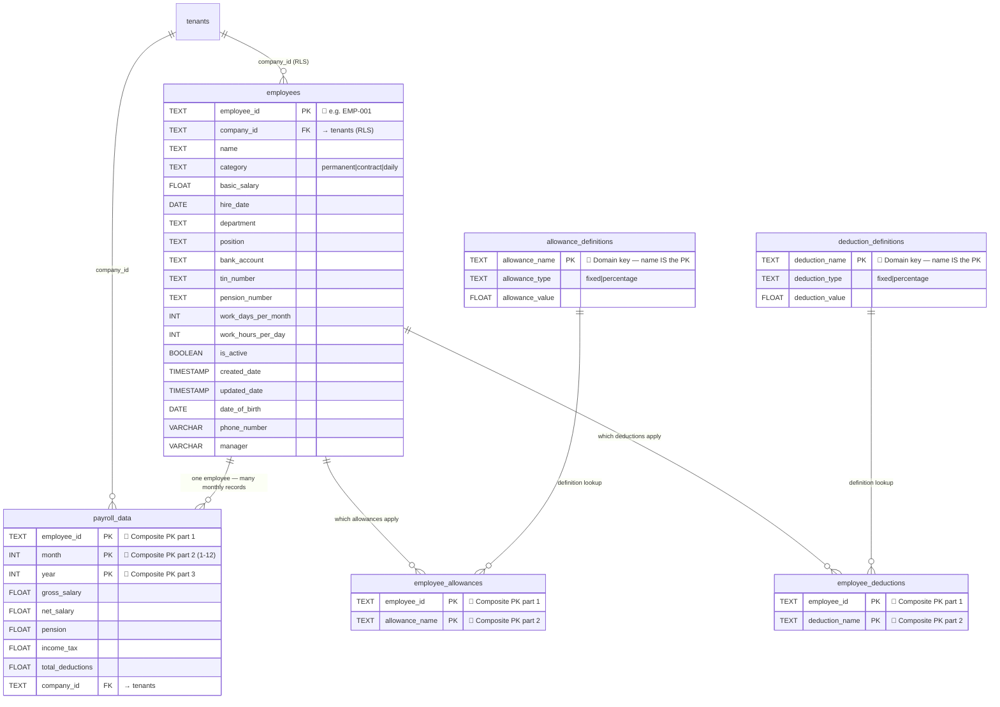
```mermaid
erDiagram
    employees {
        TEXT      employee_id        PK "🔑 e.g. EMP-001"
        TEXT      company_id         FK "→ tenants (RLS)"
        TEXT      name
        TEXT      category              "permanent|contract|daily"
        FLOAT     basic_salary
        DATE      hire_date
        TEXT      department
        TEXT      position
        TEXT      bank_account
        TEXT      tin_number
        TEXT      pension_number
        INT       work_days_per_month
        INT       work_hours_per_day
        BOOLEAN   is_active
        TIMESTAMP created_date
        TIMESTAMP updated_date
        DATE      date_of_birth
        VARCHAR   phone_number
        VARCHAR   manager
    }

    payroll_data {
        TEXT  employee_id     PK "🔑 Composite PK part 1"
        INT   month           PK "🔑 Composite PK part 2 (1-12)"
        INT   year            PK "🔑 Composite PK part 3"
        FLOAT gross_salary
        FLOAT net_salary
        FLOAT pension
        FLOAT income_tax
        FLOAT total_deductions
        TEXT  company_id      FK "→ tenants"
    }

    allowance_definitions {
        TEXT  allowance_name  PK "🔑 Domain key — name IS the PK"
        TEXT  allowance_type     "fixed|percentage"
        FLOAT allowance_value
    }

    deduction_definitions {
        TEXT  deduction_name  PK "🔑 Domain key — name IS the PK"
        TEXT  deduction_type     "fixed|percentage"
        FLOAT deduction_value
    }

    employee_allowances {
        TEXT employee_id    PK "🔑 Composite PK part 1"
        TEXT allowance_name PK "🔑 Composite PK part 2"
    }

    employee_deductions {
        TEXT employee_id    PK "🔑 Composite PK part 1"
        TEXT deduction_name PK "🔑 Composite PK part 2"
    }

    tenants               ||--o{ employees           : "company_id (RLS)"
    tenants               ||--o{ payroll_data         : "company_id"
    employees             ||--o{ payroll_data         : "one employee — many monthly records"
    employees             ||--o{ employee_allowances  : "which allowances apply"
    employees             ||--o{ employee_deductions  : "which deductions apply"
    allowance_definitions ||--o{ employee_allowances  : "definition lookup"
    deduction_definitions ||--o{ employee_deductions  : "definition lookup"
```

> **Payroll composite PK** `(employee_id, month, year)` enforces one payroll record per employee per period — `ON CONFLICT DO UPDATE` keeps recalculation idempotent.

---

## 9 · 🏛️ HRM

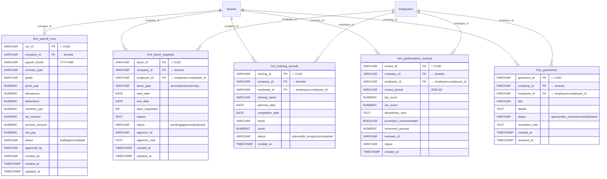
```mermaid
erDiagram
    hrm_payroll_runs {
        VARCHAR run_id         PK "🔑 UUID"
        VARCHAR company_id     FK "→ tenants"
        VARCHAR payroll_month     "YYYY-MM"
        VARCHAR contract_type
        VARCHAR grade
        NUMERIC gross_pay
        NUMERIC allowances
        NUMERIC deductions
        NUMERIC overtime_pay
        NUMERIC tax_amount
        NUMERIC pension_amount
        NUMERIC net_pay
        VARCHAR status            "draft|approved|paid"
        VARCHAR approved_by
        VARCHAR created_by
        TIMESTAMP created_at
        TIMESTAMP updated_at
    }

    hrm_leave_requests {
        VARCHAR leave_id      PK "🔑 UUID"
        VARCHAR company_id    FK "→ tenants"
        VARCHAR employee_id   FK "→ employees.employee_id"
        VARCHAR leave_type       "annual|sick|maternity|..."
        DATE    start_date
        DATE    end_date
        INT     days_requested
        TEXT    reason
        VARCHAR status           "pending|approved|rejected"
        VARCHAR approver_id
        TEXT    approver_note
        TIMESTAMP created_at
        TIMESTAMP updated_at
    }

    hrm_training_records {
        VARCHAR training_id   PK "🔑 UUID"
        VARCHAR company_id    FK "→ tenants"
        VARCHAR employee_id   FK "→ employees.employee_id"
        VARCHAR training_name
        DATE    planned_date
        DATE    completion_date
        VARCHAR result
        NUMERIC score
        VARCHAR status           "planned|in_progress|completed"
        TIMESTAMP created_at
    }

    hrm_performance_reviews {
        VARCHAR review_id     PK "🔑 UUID"
        VARCHAR company_id    FK "→ tenants"
        VARCHAR employee_id   FK "→ employees.employee_id"
        VARCHAR review_period    "2026-Q1"
        NUMERIC kpi_score
        NUMERIC okr_score
        TEXT    disciplinary_note
        BOOLEAN promotion_recommended
        NUMERIC increment_percent
        VARCHAR reviewer_id
        VARCHAR status
        TIMESTAMP created_at
    }

    hrm_grievances {
        VARCHAR grievance_id  PK "🔑 UUID"
        VARCHAR company_id    FK "→ tenants"
        VARCHAR employee_id   FK "→ employees.employee_id"
        VARCHAR title
        TEXT    details
        VARCHAR status           "open|under_review|resolved|closed"
        TEXT    resolution_note
        TIMESTAMP created_at
        TIMESTAMP resolved_at
    }

    tenants   ||--o{ hrm_payroll_runs        : "company_id"
    tenants   ||--o{ hrm_leave_requests      : "company_id"
    tenants   ||--o{ hrm_training_records    : "company_id"
    tenants   ||--o{ hrm_performance_reviews : "company_id"
    tenants   ||--o{ hrm_grievances          : "company_id"
    employees ||--o{ hrm_leave_requests      : "employee_id"
    employees ||--o{ hrm_training_records    : "employee_id"
    employees ||--o{ hrm_performance_reviews : "employee_id"
    employees ||--o{ hrm_grievances          : "employee_id"
```

---

## 10 · 📈 Finance Management


```mermaid
erDiagram
    fin_gl_entries {
        VARCHAR entry_id      PK "🔑 UUID"
        VARCHAR company_id    FK "→ tenants"
        DATE    entry_date
        VARCHAR account_code
        VARCHAR account_name
        VARCHAR cost_center
        NUMERIC amount
        VARCHAR entry_type       "debit|credit"
        VARCHAR reference
        TEXT    description
        VARCHAR created_by
        TIMESTAMP created_at
    }

    fin_ar_ap {
        VARCHAR txn_id        PK "🔑 UUID"
        VARCHAR company_id    FK "→ tenants"
        VARCHAR txn_type         "AR|AP"
        VARCHAR party_name
        VARCHAR invoice_no
        DATE    due_date
        NUMERIC amount
        NUMERIC paid_amount
        VARCHAR status           "open|partial|paid|overdue"
        TIMESTAMP created_at
    }

    fin_assets {
        VARCHAR asset_id      PK "🔑 UUID"
        VARCHAR company_id    FK "→ tenants"
        VARCHAR asset_name
        VARCHAR category
        DATE    acquisition_date
        NUMERIC acquisition_cost
        INT     useful_life_years
        VARCHAR depreciation_method  "straight_line|declining_balance"
        NUMERIC accumulated_depreciation
        NUMERIC book_value
        VARCHAR status           "active|disposed|fully_depreciated"
        TIMESTAMP created_at
    }

    fin_budgets {
        VARCHAR budget_id     PK "🔑 UUID"
        VARCHAR company_id    FK "→ tenants"
        INT     fiscal_year
        VARCHAR cost_center
        VARCHAR account_code
        NUMERIC budget_amount
        NUMERIC forecast_amount
        TIMESTAMP created_at
    }

    fin_shareholders {
        VARCHAR shareholder_id PK "🔑 UUID"
        VARCHAR company_id     FK "→ tenants"
        VARCHAR full_name
        VARCHAR national_id
        NUMERIC shares_owned
        VARCHAR share_class       "ordinary|preference"
        NUMERIC ownership_percent
        TIMESTAMP created_at
    }

    fin_dividends {
        VARCHAR dividend_id   PK "🔑 UUID"
        VARCHAR company_id    FK "→ tenants"
        DATE    declaration_date
        INT     fiscal_year
        NUMERIC total_amount
        VARCHAR status           "declared|paid|cancelled"
        TEXT    notes
        TIMESTAMP created_at
    }

    tenants ||--o{ fin_gl_entries   : "company_id"
    tenants ||--o{ fin_ar_ap        : "company_id"
    tenants ||--o{ fin_assets       : "company_id"
    tenants ||--o{ fin_budgets      : "company_id"
    tenants ||--o{ fin_shareholders : "company_id"
    tenants ||--o{ fin_dividends    : "company_id"
```

> **EOY Forecast** reads from `fin_gl_entries` (accounts `4xxx` = revenue, `5xxx/6xxx` = expense) and applies linear regression over observed months to project year-end totals.

---

## 11 · 📦 Inventory

> ✅ `inventory_items`, `inventory_categories`, `inventory_movements`, `inventory_requisitions` have RLS.

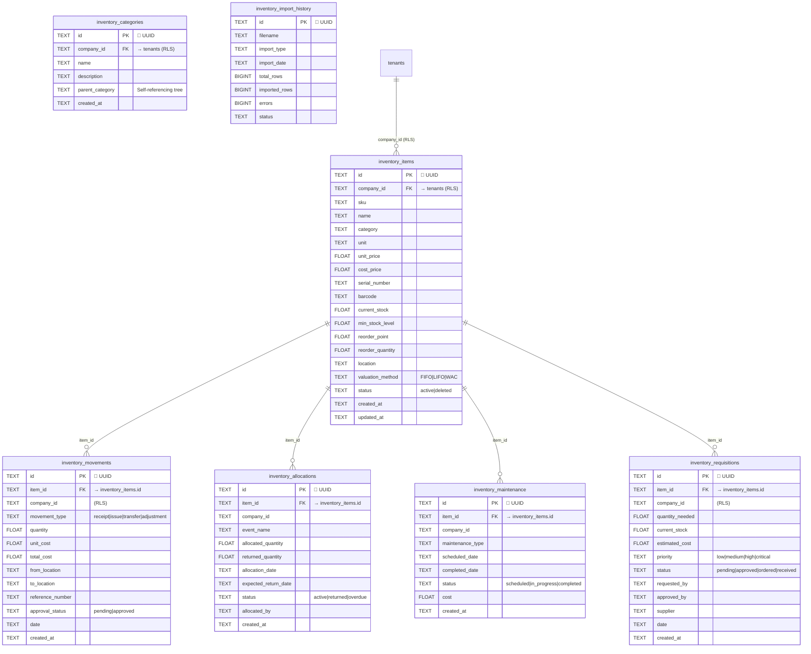
```mermaid
erDiagram
    inventory_items {
        TEXT    id              PK "🔑 UUID"
        TEXT    company_id      FK "→ tenants (RLS)"
        TEXT    sku
        TEXT    name
        TEXT    category
        TEXT    unit
        FLOAT   unit_price
        FLOAT   cost_price
        TEXT    serial_number
        TEXT    barcode
        FLOAT   current_stock
        FLOAT   min_stock_level
        FLOAT   reorder_point
        FLOAT   reorder_quantity
        TEXT    location
        TEXT    valuation_method  "FIFO|LIFO|WAC"
        TEXT    status            "active|deleted"
        TEXT    created_at
        TEXT    updated_at
    }

    inventory_categories {
        TEXT id              PK "🔑 UUID"
        TEXT company_id      FK "→ tenants (RLS)"
        TEXT name
        TEXT description
        TEXT parent_category    "Self-referencing tree"
        TEXT created_at
    }

    inventory_movements {
        TEXT  id              PK "🔑 UUID"
        TEXT  item_id         FK "→ inventory_items.id"
        TEXT  company_id         "(RLS)"
        TEXT  movement_type      "receipt|issue|transfer|adjustment"
        FLOAT quantity
        FLOAT unit_cost
        FLOAT total_cost
        TEXT  from_location
        TEXT  to_location
        TEXT  reference_number
        TEXT  approval_status    "pending|approved"
        TEXT  date
        TEXT  created_at
    }

    inventory_allocations {
        TEXT  id              PK "🔑 UUID"
        TEXT  item_id         FK "→ inventory_items.id"
        TEXT  company_id
        TEXT  event_name
        FLOAT allocated_quantity
        FLOAT returned_quantity
        TEXT  allocation_date
        TEXT  expected_return_date
        TEXT  status             "active|returned|overdue"
        TEXT  allocated_by
        TEXT  created_at
    }

    inventory_maintenance {
        TEXT  id              PK "🔑 UUID"
        TEXT  item_id         FK "→ inventory_items.id"
        TEXT  company_id
        TEXT  maintenance_type
        TEXT  scheduled_date
        TEXT  completed_date
        TEXT  status             "scheduled|in_progress|completed"
        FLOAT cost
        TEXT  created_at
    }

    inventory_requisitions {
        TEXT  id              PK "🔑 UUID"
        TEXT  item_id         FK "→ inventory_items.id"
        TEXT  company_id         "(RLS)"
        FLOAT quantity_needed
        FLOAT current_stock
        FLOAT estimated_cost
        TEXT  priority           "low|medium|high|critical"
        TEXT  status             "pending|approved|ordered|received"
        TEXT  requested_by
        TEXT  approved_by
        TEXT  supplier
        TEXT  date
        TEXT  created_at
    }

    inventory_import_history {
        TEXT   id           PK "🔑 UUID"
        TEXT   filename
        TEXT   import_type
        TEXT   import_date
        BIGINT total_rows
        BIGINT imported_rows
        BIGINT errors
        TEXT   status
    }

    tenants           ||--o{ inventory_items        : "company_id (RLS)"
    inventory_items   ||--o{ inventory_movements    : "item_id"
    inventory_items   ||--o{ inventory_allocations  : "item_id"
    inventory_items   ||--o{ inventory_maintenance  : "item_id"
    inventory_items   ||--o{ inventory_requisitions : "item_id"
```

---

## 12 · 📝 Bid Tracker

> ✅ `bid_records` has RLS.

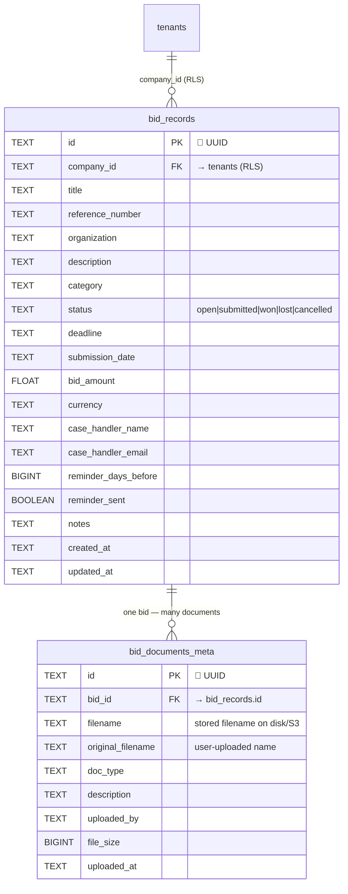
```mermaid
erDiagram
    bid_records {
        TEXT    id                   PK "🔑 UUID"
        TEXT    company_id           FK "→ tenants (RLS)"
        TEXT    title
        TEXT    reference_number
        TEXT    organization
        TEXT    description
        TEXT    category
        TEXT    status                  "open|submitted|won|lost|cancelled"
        TEXT    deadline
        TEXT    submission_date
        FLOAT   bid_amount
        TEXT    currency
        TEXT    case_handler_name
        TEXT    case_handler_email
        BIGINT  reminder_days_before
        BOOLEAN reminder_sent
        TEXT    notes
        TEXT    created_at
        TEXT    updated_at
    }

    bid_documents_meta {
        TEXT   id                PK "🔑 UUID"
        TEXT   bid_id            FK "→ bid_records.id"
        TEXT   filename             "stored filename on disk/S3"
        TEXT   original_filename    "user-uploaded name"
        TEXT   doc_type
        TEXT   description
        TEXT   uploaded_by
        BIGINT file_size
        TEXT   uploaded_at
    }

    tenants     ||--o{ bid_records        : "company_id (RLS)"
    bid_records ||--o{ bid_documents_meta : "one bid — many documents"
```

---

## 13 · 📋 CPO

> ✅ `cpo_records` has RLS.

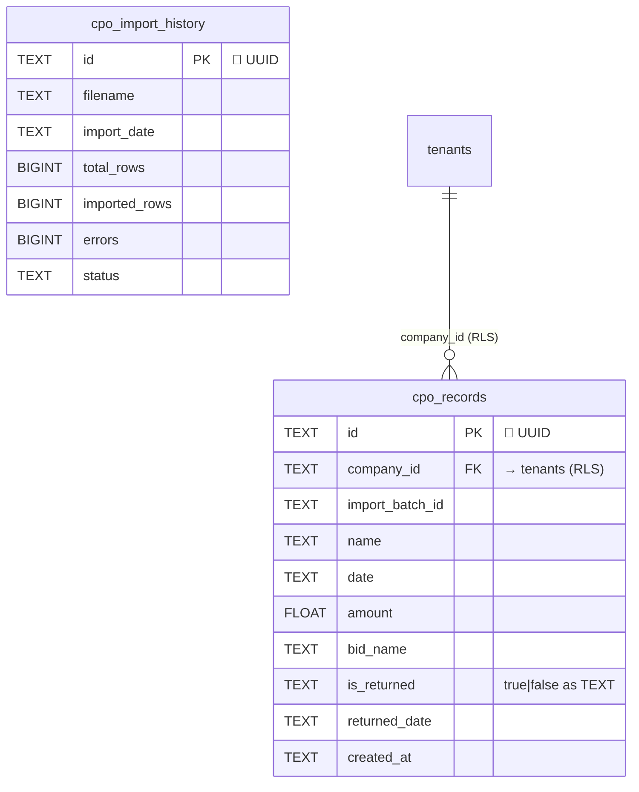
```mermaid
erDiagram
    cpo_records {
        TEXT  id             PK "🔑 UUID"
        TEXT  company_id     FK "→ tenants (RLS)"
        TEXT  import_batch_id
        TEXT  name
        TEXT  date
        FLOAT amount
        TEXT  bid_name
        TEXT  is_returned       "true|false as TEXT"
        TEXT  returned_date
        TEXT  created_at
    }

    cpo_import_history {
        TEXT   id           PK "🔑 UUID"
        TEXT   filename
        TEXT   import_date
        BIGINT total_rows
        BIGINT imported_rows
        BIGINT errors
        TEXT   status
    }

    tenants ||--o{ cpo_records : "company_id (RLS)"
```

---

## 14 · ⚙️ Machinery

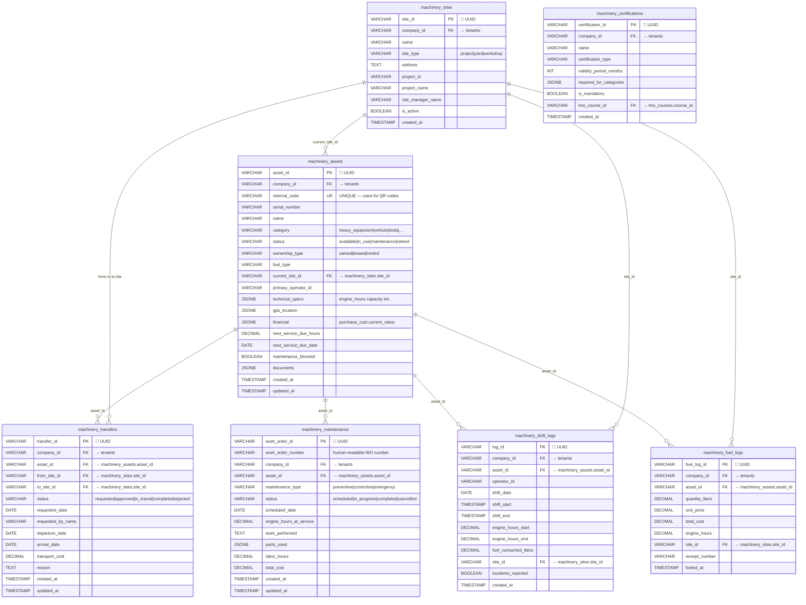
```mermaid
erDiagram
    machinery_assets {
        VARCHAR asset_id           PK "🔑 UUID"
        VARCHAR company_id         FK "→ tenants"
        VARCHAR internal_code      UK "UNIQUE — used for QR codes"
        VARCHAR serial_number
        VARCHAR name
        VARCHAR category              "heavy_equipment|vehicle|tools|..."
        VARCHAR status                "available|in_use|maintenance|retired"
        VARCHAR ownership_type        "owned|leased|rented"
        VARCHAR fuel_type
        VARCHAR current_site_id    FK "→ machinery_sites.site_id"
        VARCHAR primary_operator_id
        JSONB   technical_specs       "engine_hours capacity etc."
        JSONB   gps_location
        JSONB   financial             "purchase_cost current_value"
        DECIMAL next_service_due_hours
        DATE    next_service_due_date
        BOOLEAN maintenance_blocked
        JSONB   documents
        TIMESTAMP created_at
        TIMESTAMP updated_at
    }

    machinery_sites {
        VARCHAR site_id         PK "🔑 UUID"
        VARCHAR company_id      FK "→ tenants"
        VARCHAR name
        VARCHAR site_type          "project|yard|workshop"
        TEXT    address
        VARCHAR project_id
        VARCHAR project_name
        VARCHAR site_manager_name
        BOOLEAN is_active
        TIMESTAMP created_at
    }

    machinery_transfers {
        VARCHAR transfer_id     PK "🔑 UUID"
        VARCHAR company_id      FK "→ tenants"
        VARCHAR asset_id        FK "→ machinery_assets.asset_id"
        VARCHAR from_site_id    FK "→ machinery_sites.site_id"
        VARCHAR to_site_id      FK "→ machinery_sites.site_id"
        VARCHAR status             "requested|approved|in_transit|completed|rejected"
        DATE    requested_date
        VARCHAR requested_by_name
        DATE    departure_date
        DATE    arrival_date
        DECIMAL transport_cost
        TEXT    reason
        TIMESTAMP created_at
        TIMESTAMP updated_at
    }

    machinery_maintenance {
        VARCHAR work_order_id   PK "🔑 UUID"
        VARCHAR work_order_number  "human-readable WO number"
        VARCHAR company_id      FK "→ tenants"
        VARCHAR asset_id        FK "→ machinery_assets.asset_id"
        VARCHAR maintenance_type   "preventive|corrective|emergency"
        VARCHAR status             "scheduled|in_progress|completed|cancelled"
        DATE    scheduled_date
        DECIMAL engine_hours_at_service
        TEXT    work_performed
        JSONB   parts_used
        DECIMAL labor_hours
        DECIMAL total_cost
        TIMESTAMP created_at
        TIMESTAMP updated_at
    }

    machinery_shift_logs {
        VARCHAR log_id          PK "🔑 UUID"
        VARCHAR company_id      FK "→ tenants"
        VARCHAR asset_id        FK "→ machinery_assets.asset_id"
        VARCHAR operator_id
        DATE    shift_date
        TIMESTAMP shift_start
        TIMESTAMP shift_end
        DECIMAL engine_hours_start
        DECIMAL engine_hours_end
        DECIMAL fuel_consumed_liters
        VARCHAR site_id         FK "→ machinery_sites.site_id"
        BOOLEAN incidents_reported
        TIMESTAMP created_at
    }

    machinery_fuel_logs {
        VARCHAR fuel_log_id     PK "🔑 UUID"
        VARCHAR company_id      FK "→ tenants"
        VARCHAR asset_id        FK "→ machinery_assets.asset_id"
        DECIMAL quantity_liters
        DECIMAL unit_price
        DECIMAL total_cost
        DECIMAL engine_hours
        VARCHAR site_id         FK "→ machinery_sites.site_id"
        VARCHAR receipt_number
        TIMESTAMP fueled_at
    }

    machinery_certifications {
        VARCHAR certification_id PK "🔑 UUID"
        VARCHAR company_id       FK "→ tenants"
        VARCHAR name
        VARCHAR certification_type
        INT     validity_period_months
        JSONB   required_for_categories
        BOOLEAN is_mandatory
        VARCHAR lms_course_id    FK "→ lms_courses.course_id"
        TIMESTAMP created_at
    }

    machinery_sites    ||--o{ machinery_assets       : "current_site_id"
    machinery_assets   ||--o{ machinery_transfers    : "asset_id"
    machinery_sites    ||--o{ machinery_transfers    : "from or to site"
    machinery_assets   ||--o{ machinery_maintenance  : "asset_id"
    machinery_assets   ||--o{ machinery_shift_logs   : "asset_id"
    machinery_assets   ||--o{ machinery_fuel_logs    : "asset_id"
    machinery_sites    ||--o{ machinery_shift_logs   : "site_id"
    machinery_sites    ||--o{ machinery_fuel_logs    : "site_id"
```

---

## 15 · 🎓 LMS

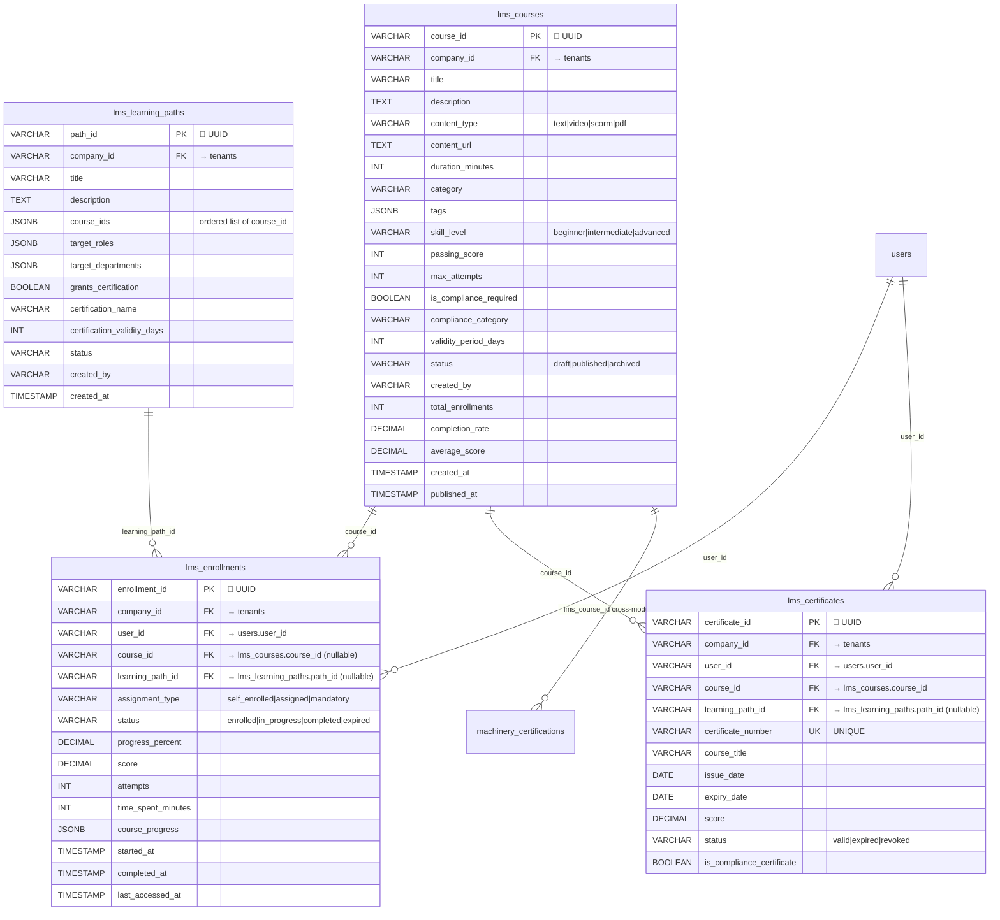
```mermaid
erDiagram
    lms_courses {
        VARCHAR course_id          PK "🔑 UUID"
        VARCHAR company_id         FK "→ tenants"
        VARCHAR title
        TEXT    description
        VARCHAR content_type          "text|video|scorm|pdf"
        TEXT    content_url
        INT     duration_minutes
        VARCHAR category
        JSONB   tags
        VARCHAR skill_level           "beginner|intermediate|advanced"
        INT     passing_score
        INT     max_attempts
        BOOLEAN is_compliance_required
        VARCHAR compliance_category
        INT     validity_period_days
        VARCHAR status                "draft|published|archived"
        VARCHAR created_by
        INT     total_enrollments
        DECIMAL completion_rate
        DECIMAL average_score
        TIMESTAMP created_at
        TIMESTAMP published_at
    }

    lms_learning_paths {
        VARCHAR path_id          PK "🔑 UUID"
        VARCHAR company_id       FK "→ tenants"
        VARCHAR title
        TEXT    description
        JSONB   course_ids          "ordered list of course_id"
        JSONB   target_roles
        JSONB   target_departments
        BOOLEAN grants_certification
        VARCHAR certification_name
        INT     certification_validity_days
        VARCHAR status
        VARCHAR created_by
        TIMESTAMP created_at
    }

    lms_enrollments {
        VARCHAR enrollment_id    PK "🔑 UUID"
        VARCHAR company_id       FK "→ tenants"
        VARCHAR user_id          FK "→ users.user_id"
        VARCHAR course_id        FK "→ lms_courses.course_id (nullable)"
        VARCHAR learning_path_id FK "→ lms_learning_paths.path_id (nullable)"
        VARCHAR assignment_type     "self_enrolled|assigned|mandatory"
        VARCHAR status              "enrolled|in_progress|completed|expired"
        DECIMAL progress_percent
        DECIMAL score
        INT     attempts
        INT     time_spent_minutes
        JSONB   course_progress
        TIMESTAMP started_at
        TIMESTAMP completed_at
        TIMESTAMP last_accessed_at
    }

    lms_certificates {
        VARCHAR certificate_id   PK "🔑 UUID"
        VARCHAR company_id       FK "→ tenants"
        VARCHAR user_id          FK "→ users.user_id"
        VARCHAR course_id        FK "→ lms_courses.course_id"
        VARCHAR learning_path_id FK "→ lms_learning_paths.path_id (nullable)"
        VARCHAR certificate_number  UK "UNIQUE"
        VARCHAR course_title
        DATE    issue_date
        DATE    expiry_date
        DECIMAL score
        VARCHAR status              "valid|expired|revoked"
        BOOLEAN is_compliance_certificate
    }

    lms_courses        ||--o{ lms_enrollments         : "course_id"
    lms_learning_paths ||--o{ lms_enrollments         : "learning_path_id"
    users              ||--o{ lms_enrollments         : "user_id"
    lms_courses        ||--o{ lms_certificates        : "course_id"
    users              ||--o{ lms_certificates        : "user_id"
    lms_courses        ||--o{ machinery_certifications : "lms_course_id cross-module"
```

---

## 16 · 🛡️ SIEM

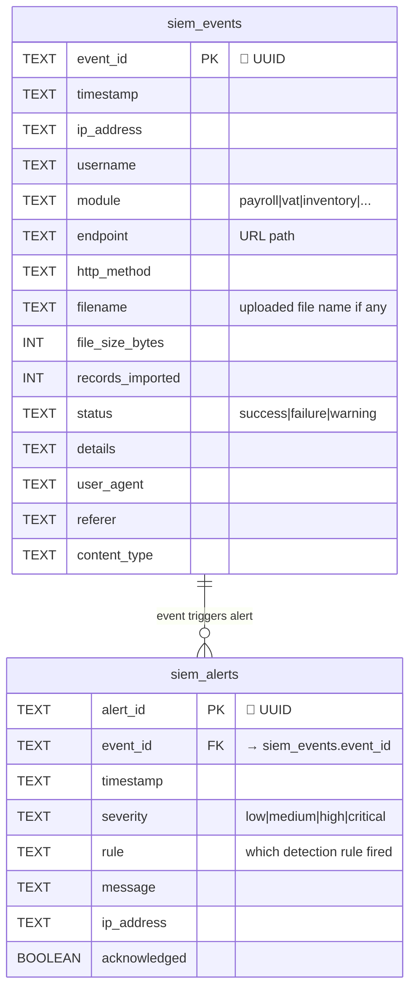
```mermaid
erDiagram
    siem_events {
        TEXT event_id        PK "🔑 UUID"
        TEXT timestamp
        TEXT ip_address
        TEXT username
        TEXT module             "payroll|vat|inventory|..."
        TEXT endpoint           "URL path"
        TEXT http_method
        TEXT filename           "uploaded file name if any"
        INT  file_size_bytes
        INT  records_imported
        TEXT status             "success|failure|warning"
        TEXT details
        TEXT user_agent
        TEXT referer
        TEXT content_type
    }

    siem_alerts {
        TEXT    alert_id     PK "🔑 UUID"
        TEXT    event_id     FK "→ siem_events.event_id"
        TEXT    timestamp
        TEXT    severity        "low|medium|high|critical"
        TEXT    rule            "which detection rule fired"
        TEXT    message
        TEXT    ip_address
        BOOLEAN acknowledged
    }

    siem_events ||--o{ siem_alerts : "event triggers alert"
```

> Every successful `POST/PUT/PATCH/DELETE` is recorded in `siem_events` by the audit-trail middleware in `app.py`.

---

## 17 · 🗂️ System

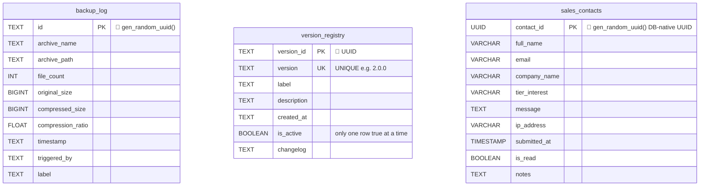
```mermaid
erDiagram
    backup_log {
        TEXT   id               PK "🔑 gen_random_uuid()"
        TEXT   archive_name
        TEXT   archive_path
        INT    file_count
        BIGINT original_size
        BIGINT compressed_size
        FLOAT  compression_ratio
        TEXT   timestamp
        TEXT   triggered_by
        TEXT   label
    }

    version_registry {
        TEXT    version_id  PK "🔑 UUID"
        TEXT    version     UK "UNIQUE e.g. 2.0.0"
        TEXT    label
        TEXT    description
        TEXT    created_at
        BOOLEAN is_active      "only one row true at a time"
        TEXT    changelog
    }

    sales_contacts {
        UUID      contact_id   PK "🔑 gen_random_uuid() DB-native UUID"
        VARCHAR   full_name
        VARCHAR   email
        VARCHAR   company_name
        VARCHAR   tier_interest
        TEXT      message
        VARCHAR   ip_address
        TIMESTAMP submitted_at
        BOOLEAN   is_read
        TEXT      notes
    }
```

---

## 🔐 RLS Policy Summary

PostgreSQL Row-Level Security enforces `company_id` isolation at the engine level. The application sets `SET LOCAL app.current_company_id = '<id>'` via `get_tenant_cursor()` before any query.

```
┌──────────────────────────────────────────────────────────────┐
│ Policy template (all 15 tables use the same pattern):         │
│                                                               │
│  CREATE POLICY rls_<table>_tenant ON <table>                  │
│    FOR ALL USING (                                            │
│      company_id = NULLIF(                                     │
│        current_setting('app.current_company_id', TRUE), ''   │
│      )                                                        │
│      OR NULLIF(                                               │
│        current_setting('app.current_company_id', TRUE), ''   │
│      ) IS NULL   -- superuser / migration bypass              │
│    );                                                         │
└──────────────────────────────────────────────────────────────┘
```

| Table | RLS Policy name |
|---|---|
| `vat_income` | `rls_vat_income_tenant` |
| `vat_expenses` | `rls_vat_expenses_tenant` |
| `vat_capital` | `rls_vat_capital_tenant` |
| `income_records` | `rls_income_records_tenant` |
| `expense_records` | `rls_expense_records_tenant` |
| `chart_of_accounts` | `rls_chart_of_accounts_tenant` |
| `journal_entries` | `rls_journal_entries_tenant` |
| `transactions` | `rls_transactions_tenant` |
| `flagged_accounts` | `rls_flagged_accounts_tenant` |
| `bid_records` | `rls_bid_records_tenant` |
| `cpo_records` | `rls_cpo_records_tenant` |
| `inventory_items` | `rls_inventory_items_tenant` |
| `inventory_categories` | `rls_inventory_categories_tenant` |
| `inventory_movements` | `rls_inventory_movements_tenant` |
| `inventory_requisitions` | `rls_inventory_requisitions_tenant` |

---

## 🔗 Declared FK Constraints (DDL-level)

Only 3 FK constraints are declared in the DDL — all others are enforced at the application layer.

```
users
  └── user_id ──────────────────────────────────── ON DELETE CASCADE
                    ├── api_tokens.user_id
                    └── refresh_tokens.user_id

users
  └── user_id ──────────────────────────────────── app-enforced only
                    ├── login_history.user_id
                    └── password_reset_tokens.user_id
```

> All `company_id`, `employee_id` (HRM), `item_id` (inventory), and parent/child (`bid_id`, `entry_id`, `asset_id`) references are enforced by application code — **no FK in the DB**. Deliberate design for flexible multi-tenant bulk imports without cascade failures.

---

## 📐 Index Summary

| Table | Indexed columns | Purpose |
|---|---|---|
| `login_history` | `user_id`, `timestamp` | Fast user history lookups |
| `licenses` | `company_id` | Module check per tenant |
| `vat_income` | `company_id`, `contract_date` | Date-range VAT queries |
| `vat_expenses` | `company_id` | |
| `vat_capital` | `company_id` | |
| `journal_entries` | `company_id`, `entry_date` | Date-filtered journal |
| `journal_entry_lines` | `entry_id` | Line lookup by entry |
| `chart_of_accounts` | `company_id` | |
| `transactions` | `company_id`, `date`, `is_flagged` | Flagged transaction filter |
| `income_records` | `company_id` | |
| `expense_records` | `company_id` | |
| `employees` | `company_id` | |
| `inventory_items` | `company_id` | |
| `inventory_movements` | `item_id` | Movement history |
| `bid_records` | `company_id` | |
| `bid_documents_meta` | `bid_id` | Document lookup |
| `cpo_records` | `company_id` | |
| `siem_events` | `timestamp`, `ip_address`, `module` | Security analysis |
| `siem_alerts` | `acknowledged` | Open alert dashboard |
| `api_tokens` | `user_id` | Token list per user |
| `refresh_tokens` | `user_id`, `expires_at` | Token cleanup |
| `machinery_assets` | `company_id`, `status`, `category`, `current_site_id` | |
| `machinery_transfers` | `status` | |
| `machinery_maintenance` | `status`, `asset_id` | |
| `lms_courses` | `company_id`, `status`, `category` | |
| `lms_enrollments` | `user_id`, `course_id`, `status` | |
| `fin_gl_entries` | `company_id`, `entry_date` | Forecast queries |
| `fin_ar_ap` | `company_id`, `txn_type`, `status` | |
| `fin_assets` | `company_id`, `status` | |
| `fin_budgets` | `company_id`, `fiscal_year` | |
| `hrm_payroll_runs` | `company_id`, `payroll_month` | |
| `hrm_leave_requests` | `company_id`, `employee_id` | |
| `hrm_training_records` | `company_id`, `employee_id` | |
| `hrm_performance_reviews` | `company_id`, `employee_id` | |
| `hrm_grievances` | `company_id`, `employee_id` | |
| `sales_contacts` | `email`, `submitted_at DESC` | Lead dedup and recency |
